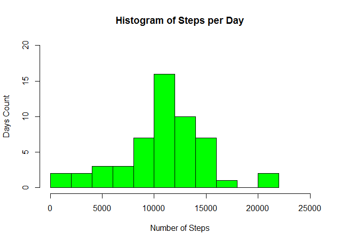
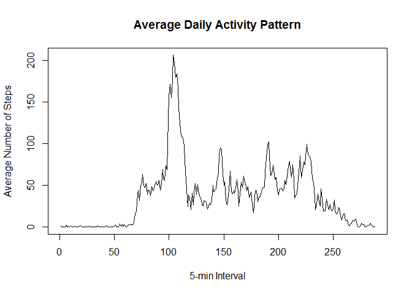
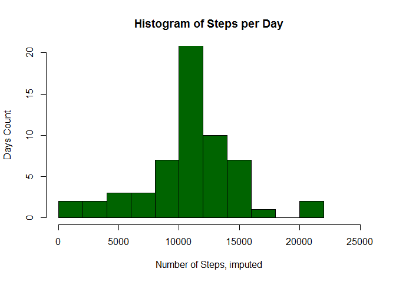

# Reproducible Research: Peer Assessment 1
### Cynthia S. Chan
26JUN2016


## Loading and preprocessing the data

```r
## check if file exists, if not unzip from the assignment repository
if(!file.exists('activity.csv')){
    unzip('activity.zip')
}
dat <- read.csv("activity.csv")

library(plyr)
library(dplyr)
```

```
## Warning: package 'dplyr' was built under R version 3.3.1
```

```
## 
## Attaching package: 'dplyr'
```

```
## The following objects are masked from 'package:plyr':
## 
##     arrange, count, desc, failwith, id, mutate, rename, summarise,
##     summarize
```

```
## The following objects are masked from 'package:stats':
## 
##     filter, lag
```

```
## The following objects are masked from 'package:base':
## 
##     intersect, setdiff, setequal, union
```


## What is mean total number of steps taken per day?
Here are the total number of steps taken per day:

```r
##  calculate total number of steps taken per day
sumSteps <-ddply(dat,.(date),summarize,sum=sum(steps))
print(sumSteps)
```

```
##          date   sum
## 1  2012-10-01    NA
## 2  2012-10-02   126
## 3  2012-10-03 11352
## 4  2012-10-04 12116
## 5  2012-10-05 13294
## 6  2012-10-06 15420
## 7  2012-10-07 11015
## 8  2012-10-08    NA
## 9  2012-10-09 12811
## 10 2012-10-10  9900
## 11 2012-10-11 10304
## 12 2012-10-12 17382
## 13 2012-10-13 12426
## 14 2012-10-14 15098
## 15 2012-10-15 10139
## 16 2012-10-16 15084
## 17 2012-10-17 13452
## 18 2012-10-18 10056
## 19 2012-10-19 11829
## 20 2012-10-20 10395
## 21 2012-10-21  8821
## 22 2012-10-22 13460
## 23 2012-10-23  8918
## 24 2012-10-24  8355
## 25 2012-10-25  2492
## 26 2012-10-26  6778
## 27 2012-10-27 10119
## 28 2012-10-28 11458
## 29 2012-10-29  5018
## 30 2012-10-30  9819
## 31 2012-10-31 15414
## 32 2012-11-01    NA
## 33 2012-11-02 10600
## 34 2012-11-03 10571
## 35 2012-11-04    NA
## 36 2012-11-05 10439
## 37 2012-11-06  8334
## 38 2012-11-07 12883
## 39 2012-11-08  3219
## 40 2012-11-09    NA
## 41 2012-11-10    NA
## 42 2012-11-11 12608
## 43 2012-11-12 10765
## 44 2012-11-13  7336
## 45 2012-11-14    NA
## 46 2012-11-15    41
## 47 2012-11-16  5441
## 48 2012-11-17 14339
## 49 2012-11-18 15110
## 50 2012-11-19  8841
## 51 2012-11-20  4472
## 52 2012-11-21 12787
## 53 2012-11-22 20427
## 54 2012-11-23 21194
## 55 2012-11-24 14478
## 56 2012-11-25 11834
## 57 2012-11-26 11162
## 58 2012-11-27 13646
## 59 2012-11-28 10183
## 60 2012-11-29  7047
## 61 2012-11-30    NA
```


Here is a histogram of the total number of steps taken per day:

```r
hist(sumSteps$sum, col="green", main="Histogram of Steps per Day", 
     xlab="Number of Steps", ylab="Days Count", xlim=c(0,25000), ylim=c(0,20), breaks=10)
```

<!-- -->


Here are the means and medians of the total number of steps taken per day:

```r
ddply(dat,.(date),summarize,Mean=mean(steps),Median=median(steps))
```

```
##          date       Mean Median
## 1  2012-10-01         NA     NA
## 2  2012-10-02  0.4375000      0
## 3  2012-10-03 39.4166667      0
## 4  2012-10-04 42.0694444      0
## 5  2012-10-05 46.1597222      0
## 6  2012-10-06 53.5416667      0
## 7  2012-10-07 38.2465278      0
## 8  2012-10-08         NA     NA
## 9  2012-10-09 44.4826389      0
## 10 2012-10-10 34.3750000      0
## 11 2012-10-11 35.7777778      0
## 12 2012-10-12 60.3541667      0
## 13 2012-10-13 43.1458333      0
## 14 2012-10-14 52.4236111      0
## 15 2012-10-15 35.2048611      0
## 16 2012-10-16 52.3750000      0
## 17 2012-10-17 46.7083333      0
## 18 2012-10-18 34.9166667      0
## 19 2012-10-19 41.0729167      0
## 20 2012-10-20 36.0937500      0
## 21 2012-10-21 30.6284722      0
## 22 2012-10-22 46.7361111      0
## 23 2012-10-23 30.9652778      0
## 24 2012-10-24 29.0104167      0
## 25 2012-10-25  8.6527778      0
## 26 2012-10-26 23.5347222      0
## 27 2012-10-27 35.1354167      0
## 28 2012-10-28 39.7847222      0
## 29 2012-10-29 17.4236111      0
## 30 2012-10-30 34.0937500      0
## 31 2012-10-31 53.5208333      0
## 32 2012-11-01         NA     NA
## 33 2012-11-02 36.8055556      0
## 34 2012-11-03 36.7048611      0
## 35 2012-11-04         NA     NA
## 36 2012-11-05 36.2465278      0
## 37 2012-11-06 28.9375000      0
## 38 2012-11-07 44.7326389      0
## 39 2012-11-08 11.1770833      0
## 40 2012-11-09         NA     NA
## 41 2012-11-10         NA     NA
## 42 2012-11-11 43.7777778      0
## 43 2012-11-12 37.3784722      0
## 44 2012-11-13 25.4722222      0
## 45 2012-11-14         NA     NA
## 46 2012-11-15  0.1423611      0
## 47 2012-11-16 18.8923611      0
## 48 2012-11-17 49.7881944      0
## 49 2012-11-18 52.4652778      0
## 50 2012-11-19 30.6979167      0
## 51 2012-11-20 15.5277778      0
## 52 2012-11-21 44.3993056      0
## 53 2012-11-22 70.9270833      0
## 54 2012-11-23 73.5902778      0
## 55 2012-11-24 50.2708333      0
## 56 2012-11-25 41.0902778      0
## 57 2012-11-26 38.7569444      0
## 58 2012-11-27 47.3819444      0
## 59 2012-11-28 35.3576389      0
## 60 2012-11-29 24.4687500      0
## 61 2012-11-30         NA     NA
```


## What is the average daily activity pattern?
The following plot shows the average number of steps taken, averaged across all days at each 5-minute interval.

```r
##  Average the number of steps across days by intervals
intervalmean <- ddply(dat,.(interval), summarize, Mean=mean(steps,na.rm=TRUE))
##  Time series plot
plot(intervalmean$Mean,type="l", main="Average Daily Activity Pattern", 
     xlab="5-min Interval", ylab="Average Number of Steps")
```

<!-- -->


On average across all days in the dataset, this is the 5-minute interval which contains the maximum number of steps.

```r
maxstep <- intervalmean[which.max(intervalmean$Mean),]
maxstep[,1]
```

```
## [1] 835
```


## Imputing missing values
This is the total number of missing values in the dataset (i.e. the total number of rows with NAs).

```r
sum(is.na(dat$steps))
```

```
## [1] 2304
```


A new dataset will be created that is equal to the original but with the missing data filled in.  The missing values will be filled in with the mean for that 5-minute interval.

```r
imputed <- data.frame(dat)

imputed <- imputed %>% group_by(interval) %>%   mutate(steps=ifelse(is.na(steps),mean(steps,na.rm=TRUE),steps))
```


Here is a histogram of the total number of steps taken each day.

```r
##  Calculate total for each day
sumsI <- ddply(imputed,.(date),summarize,sum=sum(steps))

##  plot
hist(sumsI$sum, col="dark green", main="Histogram of Steps per Day", xlab="Number of Steps, imputed", ylab="Days Count", xlim=c(0,25000), ylim=c(0,20), breaks=10)
```

<!-- -->


The mean and median total number of steps taken per day are as follows:

```r
ddply(imputed,.(date),summarize,Mean=mean(steps),Median=median(steps))
```

```
##          date       Mean   Median
## 1  2012-10-01 37.3825996 34.11321
## 2  2012-10-02  0.4375000  0.00000
## 3  2012-10-03 39.4166667  0.00000
## 4  2012-10-04 42.0694444  0.00000
## 5  2012-10-05 46.1597222  0.00000
## 6  2012-10-06 53.5416667  0.00000
## 7  2012-10-07 38.2465278  0.00000
## 8  2012-10-08 37.3825996 34.11321
## 9  2012-10-09 44.4826389  0.00000
## 10 2012-10-10 34.3750000  0.00000
## 11 2012-10-11 35.7777778  0.00000
## 12 2012-10-12 60.3541667  0.00000
## 13 2012-10-13 43.1458333  0.00000
## 14 2012-10-14 52.4236111  0.00000
## 15 2012-10-15 35.2048611  0.00000
## 16 2012-10-16 52.3750000  0.00000
## 17 2012-10-17 46.7083333  0.00000
## 18 2012-10-18 34.9166667  0.00000
## 19 2012-10-19 41.0729167  0.00000
## 20 2012-10-20 36.0937500  0.00000
## 21 2012-10-21 30.6284722  0.00000
## 22 2012-10-22 46.7361111  0.00000
## 23 2012-10-23 30.9652778  0.00000
## 24 2012-10-24 29.0104167  0.00000
## 25 2012-10-25  8.6527778  0.00000
## 26 2012-10-26 23.5347222  0.00000
## 27 2012-10-27 35.1354167  0.00000
## 28 2012-10-28 39.7847222  0.00000
## 29 2012-10-29 17.4236111  0.00000
## 30 2012-10-30 34.0937500  0.00000
## 31 2012-10-31 53.5208333  0.00000
## 32 2012-11-01 37.3825996 34.11321
## 33 2012-11-02 36.8055556  0.00000
## 34 2012-11-03 36.7048611  0.00000
## 35 2012-11-04 37.3825996 34.11321
## 36 2012-11-05 36.2465278  0.00000
## 37 2012-11-06 28.9375000  0.00000
## 38 2012-11-07 44.7326389  0.00000
## 39 2012-11-08 11.1770833  0.00000
## 40 2012-11-09 37.3825996 34.11321
## 41 2012-11-10 37.3825996 34.11321
## 42 2012-11-11 43.7777778  0.00000
## 43 2012-11-12 37.3784722  0.00000
## 44 2012-11-13 25.4722222  0.00000
## 45 2012-11-14 37.3825996 34.11321
## 46 2012-11-15  0.1423611  0.00000
## 47 2012-11-16 18.8923611  0.00000
## 48 2012-11-17 49.7881944  0.00000
## 49 2012-11-18 52.4652778  0.00000
## 50 2012-11-19 30.6979167  0.00000
## 51 2012-11-20 15.5277778  0.00000
## 52 2012-11-21 44.3993056  0.00000
## 53 2012-11-22 70.9270833  0.00000
## 54 2012-11-23 73.5902778  0.00000
## 55 2012-11-24 50.2708333  0.00000
## 56 2012-11-25 41.0902778  0.00000
## 57 2012-11-26 38.7569444  0.00000
## 58 2012-11-27 47.3819444  0.00000
## 59 2012-11-28 35.3576389  0.00000
## 60 2012-11-29 24.4687500  0.00000
## 61 2012-11-30 37.3825996 34.11321
```

The only values that differ from the estimates from the first part of the assignment are on days where are all values were NA.  By imputing the missing data using the mean for the respective 5-minute interval, the medians for those days are numeric, non-zero values, whereas the other days not requiring imputation all had medians of 0.  However, the average number of steps across all days and intervals are the same between the two.


## Are there differences in activity patterns between weekdays and weekends?
The following plot compares the average number of steps taken in each 5-minute interval across all weekday days and all weekend days.

```r
##  use dataset with imputed values
##  Create new factor variable in dataset with 2 levels (weekday and weekend)
##  indicating whether a given date is a weekday or weekend day
imputed$day <- weekdays(as.Date(imputed$date))
workweek <- c("Monday", "Tuesday", "Wednesday", "Thursday", "Friday")
imputed$dayClass <- factor((imputed$day %in% workweek), levels=c(FALSE,TRUE), 
                           labels=c("weekend", "weekday"))

##  Split up the dataset by weekday type, compute means across intervals, then rejoin datasets
weekday <- filter(imputed,dayClass=="weekday")
weekend <- filter(imputed,dayClass=="weekend")
meanwkdy <- ddply(weekday,.(interval),summarize,Mean=mean(steps))
meanwkend <- ddply(weekend,.(interval),summarize,Mean=mean(steps))
meanwkdy <- mutate(meanwkdy, dayClass="weekday")
meanwkend <- mutate(meanwkend, dayClass="weekend")
meanDaysInt <- bind_rows(meanwkdy, meanwkend)

##  Make a panel plot containing time series plot of 5-minute interval (x-axis) and the average number of steps taken, averaged across all weekday days or weekend days (y-axis)
library(lattice)
xyplot(Mean ~ interval | as.factor(dayClass), data=meanDaysInt, type="l", layout=c(1,2),
       xlab="Interval", ylab="Number of steps")
```

<!-- -->


End.
